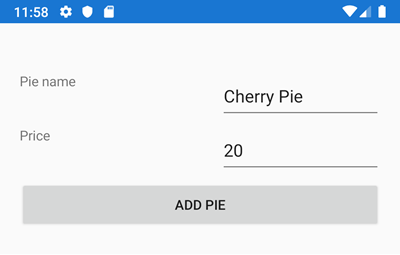

# 1. Creating Different Types of Data Binding


I MainPage.xaml haves følgende:
```xml
<Grid Margin="20, 50, 20, 10" x:Name="MainGrid">
    <Grid.RowDefinitions>
        <RowDefinition Height="50"></RowDefinition>
        <RowDefinition Height="50"></RowDefinition>
        <RowDefinition Height="50"></RowDefinition>
        <RowDefinition Height="50"></RowDefinition>
    </Grid.RowDefinitions>
    <Grid.ColumnDefinitions>
        <ColumnDefinition Width="200"></ColumnDefinition>
        <ColumnDefinition Width="*"></ColumnDefinition>
    </Grid.ColumnDefinitions>

    <!--Binding in code-->
    <Label Grid.Row="0" Grid.Column="0" Text="Pie name" ></Label>
    <Entry Grid.Row="0" Grid.Column="1" x:Name="NameEntry"></Entry>
    <Label Grid.Row="1" Grid.Column="0" Text="Price"></Label>
    <Entry Grid.Row="1" Grid.Column="1" x:Name="PriceEntry"></Entry>
    <Button Grid.Row="2" Grid.Column="0" Grid.ColumnSpan="2" Text="Add pie"></Button>
</Grid>
```


I folderen **Model** oprettes klassen **Pie**:
```cs
#region #1 BINDING IN CODE
public class Pie
{
    public int Id { get; set; }

    public string PieName { get; set; }

    public double Price { get; set; }
}
```

### #1 Oprettelse af objekt og Databinding i kode
I MainPage haves oprettelse af Pie-objekt og et par manuel binding:
```c#
// Oprettelse af Pie-objekt i koden
Pie pie = new Pie
{
    Id = 1,
    PieName = "Cherry Pie",
    Price = 20
};

#region #1 BINDING IN CODE
Binding pieNameBinding = new Binding();
pieNameBinding.Source = pie;
pieNameBinding.Path = "PieName";
NameEntry.SetBinding(Entry.TextProperty, pieNameBinding);

Binding priceBinding = new Binding();
priceBinding.Source = pie;
priceBinding.Path = "Price";
PriceEntry.SetBinding(Entry.TextProperty, priceBinding);
}
#endregion
```

### #2 Oprettelse af objekt og Databinding i XAML
I MainPage.xaml tilføjes *namespace* til Pie modellen:
`xmlns:model="clr-namespace:BethanysPieShopStockApp.Model"`

Der oprettes et object af Pie i XAML i en Resource:
```xml
<!--#2 Instantiate a Pie Object in XAML-->
<ContentPage.Resources>
    <ResourceDictionary>
        <model:Pie PieName="Apple pie" Id="1" Price="20" x:Key="ApplePie"></model:Pie>
    </ResourceDictionary>
</ContentPage.Resources>
```

Der oprettes Databinding i XAML til begge Entry kontrollerne:
```xml
<!--#2 Binding in XAML-->
<Label Grid.Row="0" Grid.Column="0" Text="Pie name"></Label>
<Entry Grid.Row="0" Grid.Column="1" Text="{Binding PieName, Source={StaticResource ApplePie}}"></Entry>
<Label Grid.Row="1" Grid.Column="0" Text="Price"></Label>
<Entry Grid.Row="1" Grid.Column="1" Text="{Binding Price, Source={StaticResource ApplePie}}"></Entry>
<Button Grid.Row="2" Grid.Column="0" Grid.ColumnSpan="2" Text="Add pie"></Button>
```

### #3 Oprettelse af objekt i kode og Databinding i XAML
Udkommentér oprettelsen af objekt i XAML og benyt oprettelsen i koden igen.
Bemærk at Grid'et hedder MainGrid.
Der kan nu laves en binding til MainGrid i koden:
```c#
MainGrid.BindingContext = pie;
```

Nu er det ikke længere nødvendigt at angive Source i forbindelse med Databinding:
```xml
<!--#3 Binding in XAML via BindingContext-->
<Label Grid.Row="0" Grid.Column="0" Text="Pie name"></Label>
<Entry Grid.Row="0" Grid.Column="1" Text="{Binding PieName}"></Entry>
<Label Grid.Row="1" Grid.Column="0" Text="Price"></Label>
<Entry Grid.Row="1" Grid.Column="1" Text="{Binding Price}"></Entry>
<Button Grid.Row="2" Grid.Column="0" Grid.ColumnSpan="2" Text="Add pie"></Button>
```

### #4 Databinding til hele Pagen vha. en Property
Ofte går man et skridt videre og laver en Property `CherryPie` i koden og binder hele Pagen `this` til en property, som vist her:
```c#
public Pie CherryPie { get; set; }  // #4

public MainPage()
{
    InitializeComponent();

    // Oprettelse af Pie-objekt i koden
    Pie CherryPie = new Pie
    {
        Id = 1,
        PieName = "Cherry Pie",
        Price = 20
    };

    #region #4 BINDING PAGE TIL PROPERTY
    CherryPie = pie;
    this.BindingContext = CherryPie;
    #endregion
}
