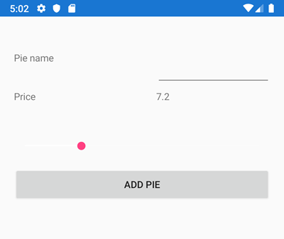

# 2. View-to-view Bindings


Opret en ny page kaldet **ViewBindingPage.xaml** med følgende indhold:
```xml
<Grid Margin="20, 50, 20, 10" x:Name="MainGrid">
    <Grid.RowDefinitions>
        <RowDefinition Height="50"></RowDefinition>
        <RowDefinition Height="50"></RowDefinition>
        <RowDefinition Height="50"></RowDefinition>
        <RowDefinition Height="50"></RowDefinition>
        <RowDefinition Height="50"></RowDefinition>
    </Grid.RowDefinitions>
    <Grid.ColumnDefinitions>
        <ColumnDefinition Width="200"></ColumnDefinition>
        <ColumnDefinition Width="*"></ColumnDefinition>
    </Grid.ColumnDefinitions>
    <Label Grid.Row="0" Grid.Column="0" Text="Pie name"></Label>
    <Entry Grid.Row="0" Grid.Column="1" Text="{Binding PieName}"></Entry>
    <Label Grid.Row="1" Grid.Column="0" Text="Price" ></Label>
    <Label Grid.Row="1" Grid.Column="1"  Text="{Binding Value}" BindingContext="{x:Reference Name=PriceSlider}"></Label>
    <Slider Grid.Row="2" x:Name="PriceSlider" Grid.ColumnSpan="2" Minimum="0" Maximum="30"></Slider>
    <Button Grid.Row="3" Grid.Column="0" Grid.ColumnSpan="2" Text="Add pie"></Button>
</Grid>
```
I App.xaml.cs sættes MainPage til at pege på den nye *ViewBindingPage*.

Her har vi lavet en Binding mellem `Value`-property på `Slider` (Source) og `Text`-property på `Label` (Target). 
Forskellen er blot at Source siden også er en Control og at vi binder til en UI-property.
